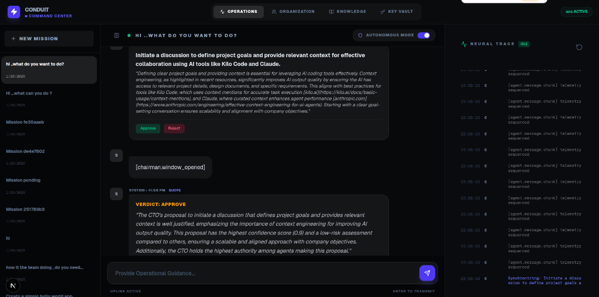
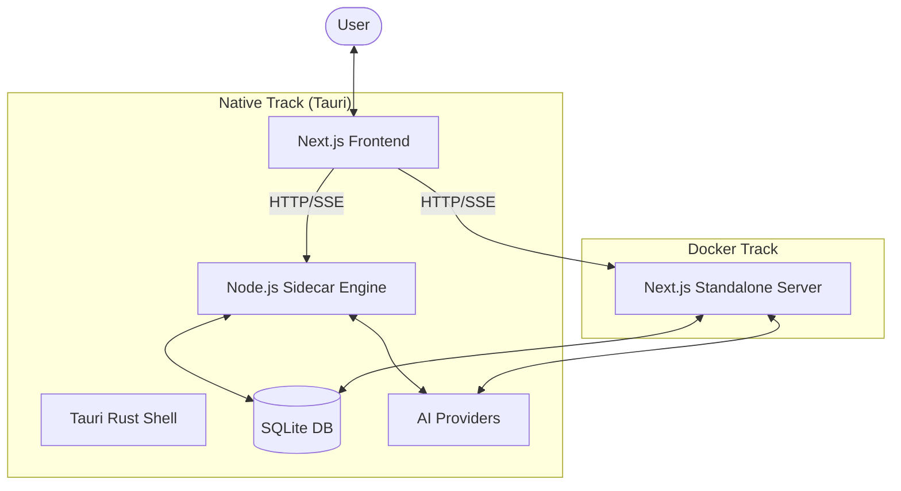

<p align="center">
  
</p>

# LLM Conduit

**LLM Conduit is ...your local multi-model AI Execution Board.**

**A sovereign, event-driven orchestration engine for autonomous agent collaboration.**

Built on Next.js with **Tauri (Rust)** and **Docker**, it provides a high-fidelity command center for managing organizational AI intelligence across multiple models and providers.

[](https://opensource.org/licenses/MIT)
[](https://github.com/Thaura644/llm-conduit/releases)
[](https://github.com/Thaura644/llm-conduit/releases)

## ✨ Key Features

- **⚡ Multi-Provider Key Vault**: Direct API integration with OpenAI, Anthropic, Google (Gemini), xAI (Grok), NVIDIA, Brave Search, and more ..via openrouter as well
- **🔍 Real-Time Web Search**: Brave Search API integration for agents to gather current information, competitive intelligence, and fact verification
- **👔 Chairman Governance**: Automated arbitration between conflicting proposals with organizational rule enforcement
- **🔄 Autonomous Mode**: Enable council to self-approve high-confidence missions without manual oversight
- **🎯 Real-Time Telemetry**: Live "Neural Trace" streaming every agent's thought process as it happens
- **📊 Persistent Memory**: SQLite-backed knowledge hub for unlimited context grounding
- **🖥️ Native Desktop**: Ultra-lightweight Tauri app (Rust-based) with secure Node.js sidecar

## 📦 Installation

### Prerequisites
- **Node.js** >= 18.x
- **Git**

### Option 1: Download Pre-Built Installer (Recommended)

Download the latest installer for your platform from the [Releases](https://github.com/Thaura644/llm-conduit/releases) page:

- **Windows**: `Conduit-Setup-{version}.exe`
- **macOS**: `Conduit-{version}.dmg`
- **Linux**: `Conduit-{version}.AppImage`

### Option 2: Install from Source

```bash
# Clone the repository
git clone https://github.com/Thaura644/llm-conduit.git
cd llm-conduit

# Install dependencies
npm install

# Run in development mode
npm run dev
```

## 🚀 Quick Start

### 1. Launch the Application

**Option A: Native Desktop (Standard)**
```bash
npm run tauri:dev
```

**Option B: Reliable Container (Zero-Setup)**
```bash
docker-compose up --build -d
```

### 2. Configure Your Team

1. Navigate to the **Organization** tab
2. Define team roles (e.g., CEO, CTO, PM, Developer)
3. Assign LLM models to each role from the roster (Grok 3, Gemini 2.0 Pro, Claude 3.5 Sonnet, etc.)

### 3. Provision API Keys

1. Open the **Key Vault** tab
2. Add direct API keys for your chosen providers:
   - **LLM Providers**: OpenAI, Anthropic, Google, xAI, etc.
   - **Web Search**: Brave Search API key (starts with "BSA" - get at https://brave.com/search/api/)
3. Test connectivity using the built-in health check

> **💡 Brave Search Integration**: With Brave API key configured, your agents can now search the web in real-time to:
> - Verify facts and current events
> - Research competitive intelligence  
> - Get latest market trends and news
> - Find up-to-date documentation and best practices

### 4. Issue Your First Mission

```plaintext
Navigate to Operations > New Mission
Enter: "Create a simple Hello World app in Go"
Press Enter to Transmit
```

The council will:
- Analyze the objective
- Propose execution strategies
- Await your approval or auto-execute (if Autonomous Mode is enabled)
- Stream all decision-making telemetry in real-time

## 🔀 Versioning & Updates

This project follows **[Semantic Versioning (SemVer)](https://semver.org/)**. Given a version number `MAJOR.MINOR.PATCH`, we increment the:

- **MAJOR** version when we make incompatible API changes
- **MINOR** version when we add functionality in a backward-compatible manner
- **PATCH** version when we make backward-compatible bug fixes

### What This Means for You

- ✅ **PATCH updates** (`~0.1.4`): Safe bug fixes — update freely
- ✅ **MINOR updates** (`^0.1.0`): New features, backward-compatible — low risk
- ⚠️ **MAJOR updates** (`1.0.0`): May contain breaking changes — review changelog

## 🗺️ Roadmap

- **v0.2.0** - Enhanced rejection-triggered re-strategizing, expanded web search capabilities
- **v0.3.0** - Multi-session parallel missions, search result caching
- **v1.0.0** - Stable API, custom agent plugin system, advanced search filters

## 🏗️ Architecture



## 👥 Contributing

We welcome contributions! LLM Conduit is a community-driven project. To get started:

1. **🌟 Star the project** to show your support and stay updated!
2. **🔍 Find an Issue**: Browse our [GitHub Issues](https://github.com/Thaura644/llm-conduit/issues) to find something to work on.
3. **🙋 Request Permission**: If you find an issue you'd like to tackle, please comment on it to request permission/assignment so we avoid duplicate work.
4. **📝 Report Bugs**: Found a bug? Open a new issue with detailed reproduction steps.
5. **💡 Propose Features**: Have an idea? Start a discussion or open a feature request.

### Pull Request Process
1. Fork the repository
2. Create a feature branch (`git checkout -b feature/amazing-feature`)
3. Commit your changes (`git commit -m 'Add amazing feature'`)
4. Push to the branch (`git push origin feature/amazing-feature`)
5. Open a Pull Request

### 🛠️ Development Setup

1. **Install Dependencies**
   ```bash
   npm install
   ```

2. **Launch Development Environment (Unified)**
   This starts the Sidecar Engine (Port 3001) and Next.js (Port 3000) concurrently:
   ```bash
   npm run dev
   ```

3. **Launch Tauri Shell (Native Mode)**
   ```bash
   npm run tauri:dev
   ```

### Code Style

- Follow existing TypeScript/React patterns
- Keep functions pure and testable
- Document complex logic with comments
- Use descriptive variable names

## 🚀 Distribution Tracks

LLM Conduit can be run as a native desktop application (Tauri) or as a portable container (Docker).

### 📊 Comparison Matrix

| Feature | 🖥️ Tauri (Native) | 🐋 Docker (Container) |
| :--- | :--- | :--- |
| **User Experience** | Native window, Menubar, Tray icon | Browser-based UI (`localhost:3000`) |
| **Reliability** | Depends on System OS & Drivers | **Maximum** (Isolated environment) |
| **Setup Type** | Single File (`.deb` / `.exe`) | Containerized Orchestration |
| **Performance** | Ultra-light (Rust-based) | Standard (Node.js runtime) |
| **Best For** | Daily desktop use | Servers, Headless, & Debugging |

---

## 🛠️ Getting Started

### Track A: Native Desktop (Tauri)
**Recommended for the "premium" experience.**

**1. Install Rust & Dependencies (Linux only)**
```bash
# System libraries
sudo apt update && sudo apt install -y libwebkit2gtk-4.1-dev libappindicator3-dev librsvg2-dev build-essential curl wget libssl-dev libgtk-3-dev
# Rustup
curl --proto '=https' --tlsv1.2 -sSf https://sh.rustup.rs | sh
```

**2. Build & Launch**
```bash
npm run tauri dev
```

### Track B: Reliable Container (Docker)
**Recommended if you want "zero-setup" and total reliability.**

**1. Launch with Compose**
```bash
docker-compose up --build -d
```

**2. Access the Dashboard**
Open your browser to: `http://localhost:3000`

---

## 🏗️ Production Builds & Cross-Platform

LLM Conduit supports building for multiple platforms. While native host builds are recommended, we have configured **Local Cross-Compilation** to allow generating Windows installers directly from Linux.

### 🐧 Local "Free" Track (Linux Host)
We have configured your environment to build Linux and Windows installers without needing a second machine or cloud services.

**1. Build for Linux (.deb / .rpm)**
```bash
npm run tauri:build
```

**2. Build for Windows (.exe)**
```bash
# Generate Windows sidecar then build
npx pkg dist/sidecar-server.js -t node18-win-x64 -o src-tauri/binaries/sidecar-server-x86_64-pc-windows-gnu.exe
npm run tauri build -- --target x86_64-pc-windows-gnu
```

### 🚀 Automated Distribution (Recommended)
For large-scale releases, you can use **GitHub Actions**.
- **Public Repos**: 100% Free.
- **Private Repos**: Uses free minutes (2x multiplier for Windows runners).

---

## 🐧 Linux Troubleshooting (Native Mode)

## ❓ Support

- **Questions?** Open a [GitHub Discussion](https://github.com/Thaura644/llm-conduit/discussions)
- **Bugs?** Report via [GitHub Issues](https://github.com/Thaura644/llm-conduit/issues)
- **Security?** Email security concerns to [my Email](mailto:jamesthaura51@gmail.com)

## 📄 License

This project is licensed under the [MIT License](LICENSE) - see the LICENSE file for details.


```bash
sudo apt update
sudo apt install libwebkit2gtk-4.1-dev
```

### WebKit2GTK Error
If the app fails to launch with a "WebKit2GTK not found" error:
```bash
sudo apt update
sudo apt install libwebkit2gtk-4.1-dev
```

## 🙏 Acknowledgments

- **Author**: **[James Thaura Mweni](https://github.com/Thaura644/)** ([LinkedIn](http://linkedin.com/in/jamesthaura))
- Built on Next.js, React, and Tauri (Rust)
- Powered by OpenAI, Anthropic, Google, xAI, NVIDIA, and other leading AI providers
- Inspired by the vision of sovereign agentic collaboration and **Andrej Karpathy's (@karpathy) [llm-council](https://github.com/karpathy/llm-council)** project.

---

**Built for the era of autonomous intelligence governance.**
